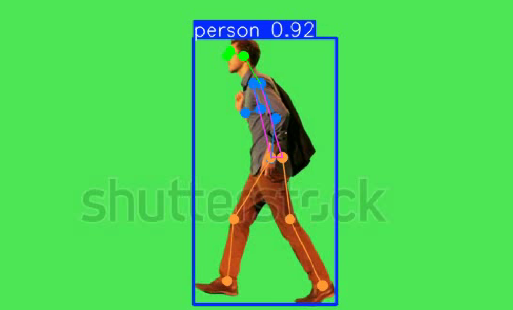

# Forensic Gait Analysis

Forensic Gait Analysis is a tool that compares two video footages, one from a crime scene and another from a suspect, to determine if they depict the same person based on their gait patterns.

## Installation

1. Clone this repository:

    ```bash
    git clone https://github.com/your-username/forensic-gait-analysis.git
    cd forensic-gait-analysis
    ```

2. Install the dependencies:

    ```bash
    pip install -r requirements.txt
    ```

## Usage

### Step 1: Preprocess the Videos

1. Update the paths in `preprocess.py` to point to the crime scene and suspect videos.
2. Run the preprocessing script to convert each video to 20 fps and trim them to 6 seconds:

    ```bash
    python preprocess.py
    ```

### Step 2: Calculate Keypoints

1. Update the paths in `pose.py` to point to the processed videos.
2. Run the keypoint calculation script to generate keypoint data for each frame:

    ```bash
    python pose.py
    ```

3. **Example Output (Keypoints Extraction):**
    ```
    Loading sequences...

    Extracting keypoints...
    Frame data shape: (120, 56)
    Number of values in first frame: 56
    First frame keypoints length: 49
    Frame data shape: (120, 56)
    Number of values in first frame: 56
    First frame keypoints length: 49
    ```

   This output shows the process of loading the video frames and extracting keypoints. The data shape and the number of keypoints per frame are displayed to verify the extraction.

4. **Example Image (Keypoints Visualization):**
   

   The above image visualizes the detected keypoints (such as joints and limbs) for a frame in the video. This step captures and marks body keypoints to extract gait-related features.

### Step 3: Calculate Gait Similarity

1. Update the paths in `gait-similarity.py` to point to the folder containing the keypoint labels.
2. Run the gait similarity calculation and visualization script:

    ```bash
    python gait-similarity.py
    ```

3. **Example Output (Gait Similarity Analysis):**
    ```
    Calculating gait features for sequence 1...

    Processing Summary:
    Valid frames: 120
    Invalid frames: 0
    Valid frame percentage: 100.00%

    Feature Statistics:
    Step Length - Mean: 0.5023, Std: 0.0229
    Stance Width - Mean: 0.2843, Std: 0.1166
    Left Knee Angle - Mean: 8.72, Std: 7.12
    Right Knee Angle - Mean: 41.02, Std: 2.87

    Calculating gait features for sequence 2...

    Processing Summary:
    Valid frames: 120
    Invalid frames: 0
    Valid frame percentage: 100.00%

    Feature Statistics:
    Step Length - Mean: 0.5281, Std: 0.0196
    Stance Width - Mean: 0.2505, Std: 0.1737
    Left Knee Angle - Mean: 12.59, Std: 8.84
    Right Knee Angle - Mean: 42.85, Std: 2.39

    Comparing sequences...

    Overall Similarity Score: 68.53%

    Detailed Metrics (higher is more similar):
    Step Length: 67.69%
    Stance Width: 68.08%
    Left Knee Angle: 67.19%
    Right Knee Angle: 71.17%

    Generating visualization...
    ```

4. **Example Image (Gait Similarity Visualization):**
   

   The above image shows a visual comparison of gait features extracted from the two sequences. Each feature’s similarity score and an overall score are provided to help identify if the two footages depict the same person.

## Example

After completing the steps above, the `gait-similarity.py` script will output a similarity score and visualizations to help identify if the two footages depict the same person based on gait analysis.
# gdem
